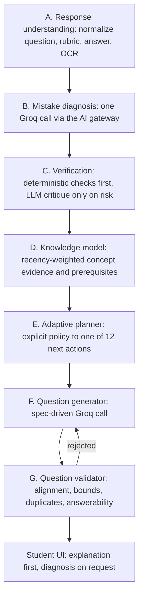

# Adaptive diagnostics engine

The diagnostics engine replaces score-only grading with an evidence-based pipeline that
says *what* the student got wrong, *why* the evidence supports that reading, *what is
still unknown*, and *which* learning action comes next.

It lives in `learnova/diagnostics/` and is Flask-independent, so every rule is unit
testable without a request context or an AI provider.

## Pipeline



Every provider call goes through `learnova.ai_services.service.create_response`, so the
cached and live modes, token budgets, usage limits, sanitized error categories, the single
corrective retry and the JSONL telemetry all apply unchanged.

## Component responsibilities

| Module | Responsibility |
| --- | --- |
| `taxonomy.py` | Correctness statuses, diagnosis tags, interventions, next actions, cognitive demands. Localized labels (en/de) and an extension point for new tags. |
| `schema.py` | Versioned diagnostic contract: strict validation, safe normalization, evidence-link enforcement, the student-facing presentation mapping. |
| `verification.py` | Deterministic answer/arithmetic/consistency checks and the risk score that decides whether a second independent critique is worth a call. |
| `knowledge.py` | Concept evidence over time: recency-weighted score, evidence weight, uncertainty, prerequisite-graph operations, explainable mastery reasons. |
| `planner.py` | The adaptive policy. Maps diagnosis + knowledge state + history to one next action, a bounded difficulty and machine-readable question constraints. |
| `question_spec.py` | The machine-readable question specification and its deterministic validator (concept alignment, difficulty bounds, ambiguity, answerability, duplicates). |
| `prompts.py` | Diagnosis, verification and question-generation prompts; no hidden reasoning is ever requested or stored. |
| `evaluation.py` | The offline harness: runs labeled cases through the pipeline and reports agreement, schema validity, validation pass rate, duplicate rate and policy behaviour. |

## Diagnostic contract (`diagnosis:v2`)

```jsonc
{
  "analysis_version": "diagnosis:v2",
  "correctness_status": "correct | partially_correct | incorrect | insufficient_evidence",
  "score": {
    "points": 0.0,
    "max_points": 1.0,
    "rubric_evidence": [{"criterion": "...", "met": true, "evidence_ids": ["e1"]}]
  },
  "concepts_assessed": ["..."],
  "primary_diagnosis":   {"tag": "procedural_error", "statement": "...", "evidence_ids": ["e2"]},
  "secondary_diagnoses": [{"tag": "...", "statement": "...", "evidence_ids": ["e3"]}],
  "evidence": [{"id": "e1", "source": "student_answer", "quote": "..."}],
  "misconception_description": "",
  "prerequisite_gaps": [{"concept": "...", "evidence_ids": ["e2"]}],
  "missing_evidence": false,
  "missing_evidence_reason": "",
  "confidence": {"value": 0.0, "basis": "..."},
  "recommended_intervention": "worked_example",
  "next_action": "worked_example_then_practice",
  "candidate_question_constraints": {},
  "student_facing_explanation": "...",
  "internal_diagnostic_summary": "...",
  "validation_status": "validated | repaired | deterministic_conflict | unverified | rejected"
}
```

**Evidence links are enforced in code, not trusted.** Every `evidence_ids` entry must
resolve to an item in `evidence[]`. A diagnosis tag that carries no resolvable evidence is
dropped; if the *primary* tag is dropped, the whole result degrades to
`insufficient_evidence` with `next_action = diagnostic_check`. This is the anti-invention
guarantee: the model cannot assert a misconception, a prerequisite gap or a student
intention without quoting the material it came from.

`internal_diagnostic_summary` is a concise findings note, not deliberation: the prompt
forbids hidden reasoning and the normalizer truncates it. It is never sent to the browser.

## Mistake taxonomy

`correct`, `partially_correct`, `conceptual_misconception`, `procedural_error`,
`prerequisite_gap`, `interpretation_error`, `arithmetic_or_transcription_error`,
`incomplete_reasoning`, `guessing_or_uncertain`, `insufficient_evidence`, plus the
extension tag `question_or_key_flawed` for a defective question or answer key.

There is deliberately no "careless error" tag. A one-off slip is
`arithmetic_or_transcription_error`, which the planner explicitly refuses to treat as a
reason to lower difficulty.

New tags are added by extending `DIAGNOSIS_TAGS` and its label maps in `taxonomy.py`; the
schema, prompt and UI read from that single source.

## Adaptive policy

`planner.plan_next_action` is pure and deterministic. Ordered rules:

1. `insufficient_evidence` / `missing_evidence` -> `diagnostic_check`, or
   `human_review_or_insufficient_evidence` after repeated failures. Difficulty unchanged.
2. `question_or_key_flawed` -> `human_review_or_insufficient_evidence`; the student is never
   penalized and mastery is not reduced.
3. `interpretation_error` -> `clarify_instruction`. Difficulty unchanged.
4. `prerequisite_gap` -> `prerequisite_reteach` targeting the named prerequisite, difficulty -1.
5. `conceptual_misconception` -> `misconception_contrast` when the same misconception recurs,
   otherwise `worked_example_then_practice`. Difficulty unchanged.
6. `procedural_error` -> `worked_example_then_practice` first, `targeted_practice` on repeat.
7. `arithmetic_or_transcription_error` -> `targeted_practice`, difficulty explicitly held.
8. `incomplete_reasoning` -> `targeted_practice` demanding justification.
9. `guessing_or_uncertain` -> `diagnostic_check` at lower cognitive demand.
10. `partially_correct` -> `targeted_practice`, difficulty held.
11. `correct` -> `increase_difficulty` **only** when the concept has at least
    `PROMOTION_STREAK` recent correct answers at the current difficulty, no hints, mastery
    above the promotion threshold and uncertainty below the promotion cap; otherwise
    `spaced_retrieval` when review is due, `transfer_question` at maximum difficulty, else
    `maintain_difficulty`.

Difficulty moves at most one level per step and is clamped to 1..3. A reduction requires at
least `DEMOTION_STREAK` consecutive incorrect answers *and* a conceptual or prerequisite
cause - never a single wrong answer and never a slip. An increase immediately after a
decrease (or the reverse) on the same concept is suppressed as oscillation.

## Knowledge model

`ConceptMastery` keeps its existing score and SRS fields. The engine adds three evidence
columns maintained incrementally, with no extra queries:

* `evidence_weight` - exponentially decayed count of observations
  (`weight * 0.5 ** (age_days / HALF_LIFE_DAYS)` plus the new observation's weight).
* `uncertainty` - `1 / (1 + evidence_weight)`; starts at 1.0, so an unassessed concept is
  distinguishable from a weakly mastered one.
* `last_action` - the planner action that produced the most recent question.

Observation weight is reduced by hints, missing evidence, low diagnosis confidence and OCR
uncertainty, and raised slightly by difficulty. `MasteryHistory.reason` records a short,
human-readable explanation of every update.

Prerequisites discovered from evidence-backed diagnoses accumulate in
`concept_prerequisite` with an evidence count, so a single response never creates a
permanent conclusion: `knowledge.confirmed_prerequisites` only returns edges seen at least
`PREREQUISITE_MIN_EVIDENCE` times.

## API and UI

`POST /api/answer` is unchanged for existing clients: `evaluation`, `next_question`,
`progress`, `summary` and the legacy `analysis` object are still returned. It gains a
`diagnosis` object (the contract above, with internal fields stripped) and
`analysis.next_action`.

`GET /api/diagnosis/<attempt_id>` returns the stored student-safe diagnosis for progressive
disclosure - the answer card shows the short explanation, and the detail panel is fetched
only when the student opens it.

Internal fields (`internal_diagnostic_summary`, raw evidence quotes of prior attempts) are
never sent to the browser; `schema.student_view` is the only mapping used for responses.

## Cost

One diagnosis call per answer, replacing the previous `mistake_analysis` call - cost
neutral. A second verification call happens only when the deterministic checks return a
risk score above `AI_DIAGNOSIS_VERIFY_RISK_THRESHOLD`, and never when the deterministic
checker already proved the answer right or wrong. Question generation reuses the existing
`adaptive_practice` task type; a failed validation costs at most
`AI_QUESTION_MAX_REGENERATIONS` extra attempts before the planner falls back to the
previous behaviour.

## Evaluation

`learnova/diagnostics/evaluation.py` runs labeled cases (`tests/fixtures/diagnostics/cases.json`)
through the pipeline and reports diagnosis agreement, correctness agreement, schema
validity, evidence-link pass rate, question-validation pass rate, duplicate rate, and
adaptive-policy behaviour (difficulty oscillation, forbidden promotions/demotions).

Run it offline with `python scripts/run_diagnostic_eval.py` (deterministic, no provider
calls: it replays the labeled model outputs stored in the case file). `pytest
tests/test_diagnostics.py` asserts the harness thresholds so a regression fails CI.

No claim is made that the engine outperforms a human teacher; the harness only measures
agreement with the labeled cases it ships with.
