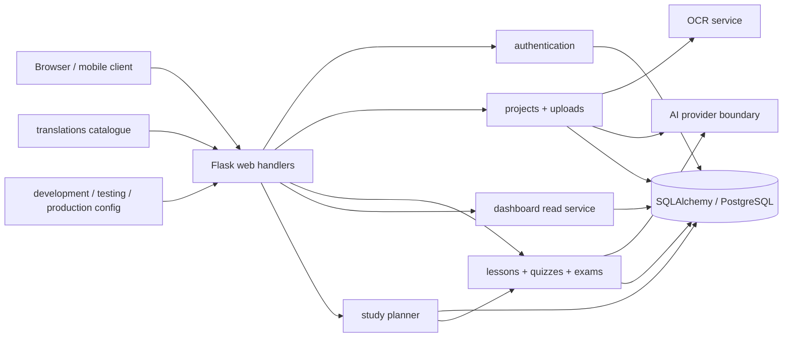

# Learnova architecture

## Design goals

Learnova uses a domain-oriented Flask architecture. HTTP handlers translate requests and responses; domain services perform validation and business work; SQLAlchemy owns persistence; AI transport is behind one provider boundary. Existing route endpoint names and the root `app.py` import surface remain stable for deployments and older tests.



## Folder structure

```text
learnova/
  ai_services/       provider boundary and shared tutor prompts
  authentication/    account normalization, validation and authentication
  dashboard/         optimized dashboard and daily-practice read models
  exams/             exam scoring and allocation rules
  lessons/           lesson/session domain namespace
  ocr/               magic-byte validation, image processing and recognition helpers
  projects/          source-grounded project and study-plan rules
  quizzes/           deterministic mastery, scheduling and adaptive selection
  settings/          account preference domain namespace
  study_planner/     deterministic schedules, redistribution and readiness metrics
  translations/      single interface catalogue
  uploads/           transactional upload/PDF ingestion
  utilities/         cross-cutting, domain-neutral helpers
  web/               response envelopes and browser security policy
  config.py          environment profiles
  extensions.py      unbound Flask extensions
templates/
  components/        navbar, footer, alerts, loading, modal mount and language selector
static/
  css/               tokens and shared components
  js/                core security/navigation, i18n, DOM and symbol modules
docs/                 architecture and extension guidance
app.py                compatible WSGI/CLI composition root and route orchestration
```

The top-level `adaptive_learning.py`, `document_processing.py`, `study_projects.py`, and `i18n.py` are compatibility shims. New code must import from `learnova.*`.

## Module responsibilities

| Module | Owns | Must not own |
| --- | --- | --- |
| `authentication` | credential validation, password-backed user creation, identity lookup | templates or redirects |
| `uploads` | one transaction for files/pages, de-duplication and page limits | request parsing |
| `ocr` | file signatures, conservative image work and recognition normalization | account authorization |
| `ai_services` | mock/cached/live gateway, sole provider client, private cache keys, sanitized accounting, JSON parsing and shared prompts | database transactions or raw student-data logging |
| `projects` | section normalization, source weighting and preparation plans | Flask globals |
| `quizzes` | deterministic mastery, difficulty and spaced repetition | AI mastery decisions |
| `study_planner` | exam countdowns, task priority, schedule generation, incremental adaptation, redistribution, calendar/readiness metrics | Flask requests, ownership, AI decisions, or translated persistence text |

Browser-native speech recognition and speech synthesis are optional frontend accessibility adapters. Shared Jinja controls declare targets and accessible labels; `speech-to-text.js` and `text-to-speech.js` own capability detection, lifecycle cancellation, language selection, and single-active-session behavior. They do not send audio to Flask, persist raw audio, submit forms, or bypass normal answer review.
| `exams` | deterministic scoring and question allocation | answer visibility policy in templates |
| `dashboard` | user-filtered read queries and eager loading | mutations |
| `translations` | interface strings and frontend catalogue | learning records |
| `web` | JSON envelopes, headers and HTTP concerns | learning rules |

## Persistence and scaling

All ownership queries include the authenticated user. Composite indexes cover the high-volume user/review, lesson/attempt, project/page, section/order, exam/question, and study-plan/session paths. Migrations `009_add_query_path_indexes` and `011_add_intelligent_study_planner` upgrade existing SQLite and PostgreSQL databases additively. PostgreSQL is the production target; SQLite remains supported for local development and tests.

The in-memory `SESSIONS` dictionary is only a worker-local accelerator. `StudySession.state_json` is authoritative and restores progress after restarts. A future Redis adapter can replace the accelerator without changing stored lesson behavior.

`StudyPlan` owns exam goals and preferences. `StudyPlanSession` owns calendar tasks and completion; it is intentionally distinct from the legacy lesson-state `StudySession`. Routes parse and authorize, while `learnova.study_planner.service` receives plain data and performs deterministic scheduling. Completion hooks pass score/concept evidence back to the service and rewrite affected future sessions only. Tutor chat receives a sanitized summary of today's scheduled tasks, but AI cannot mutate dates, mastery, ownership, or completion.

## Security boundaries

- secrets and provider credentials come from environment variables; production refuses to start without `SECRET_KEY`;
- CSRF protects unsafe form and JSON requests; tests are explicitly isolated;
- sensitive and AI-heavy endpoints are rate limited;
- uploads are checked by content signature and processed in memory;
- ORM expressions are used instead of interpolated SQL for user input;
- Jinja autoescaping remains enabled and JSON is emitted through `jsonify`/`tojson`;
- CSP, frame denial, MIME sniffing prevention, referrer, permissions and HTTPS HSTS headers are centralized.
